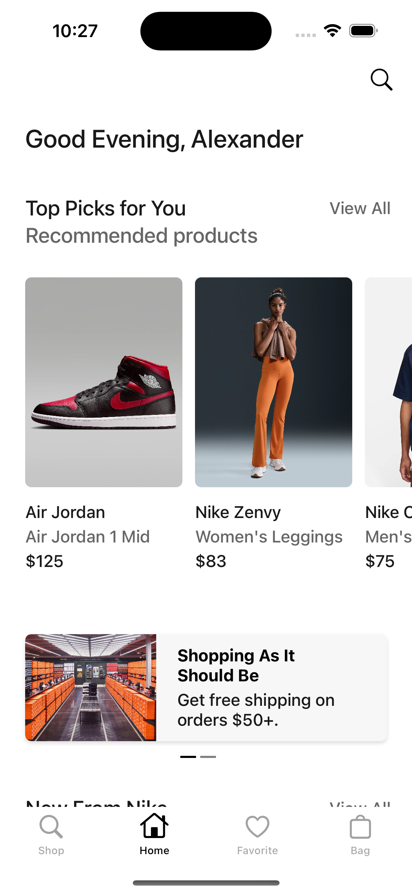
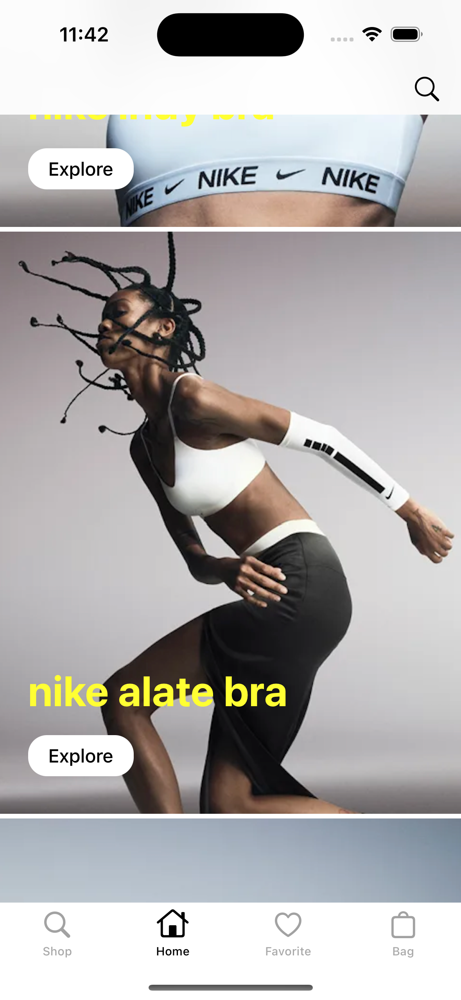
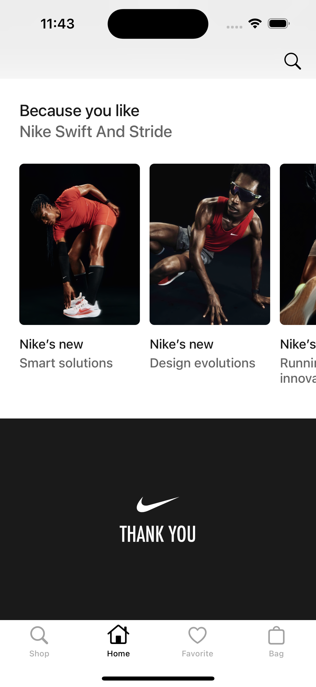
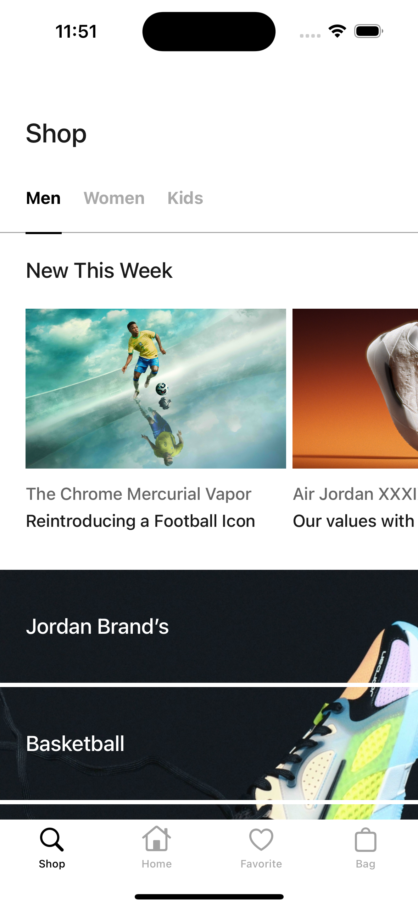
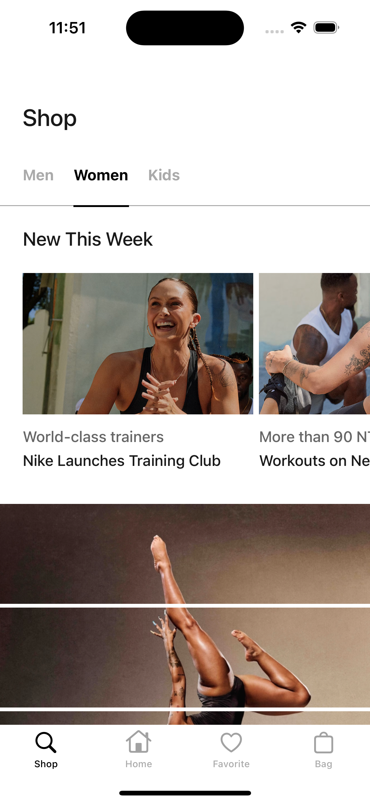
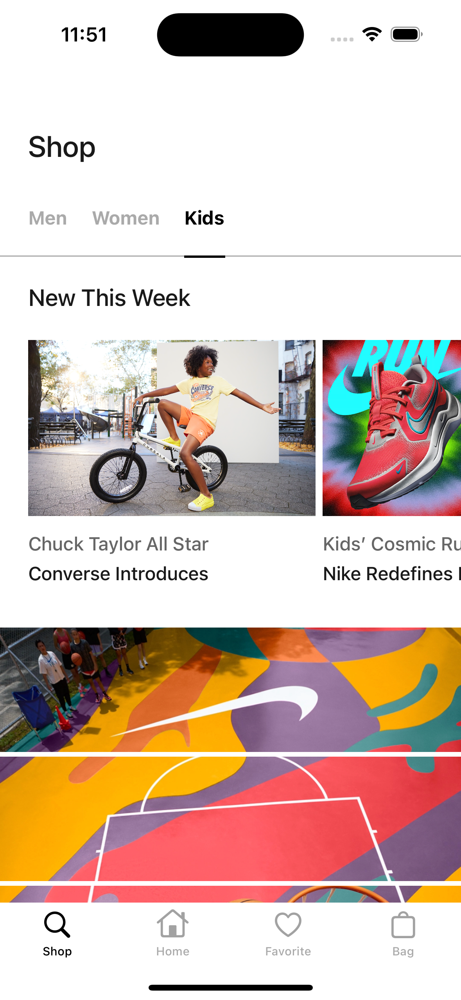
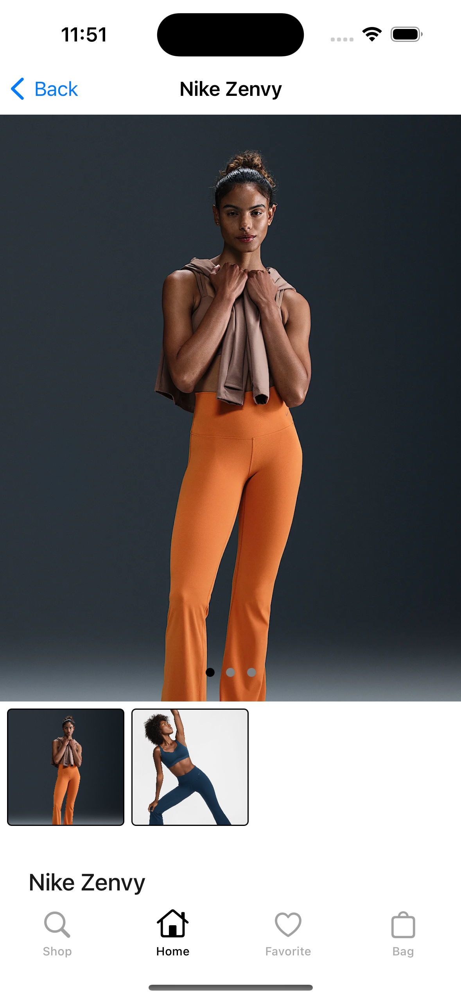
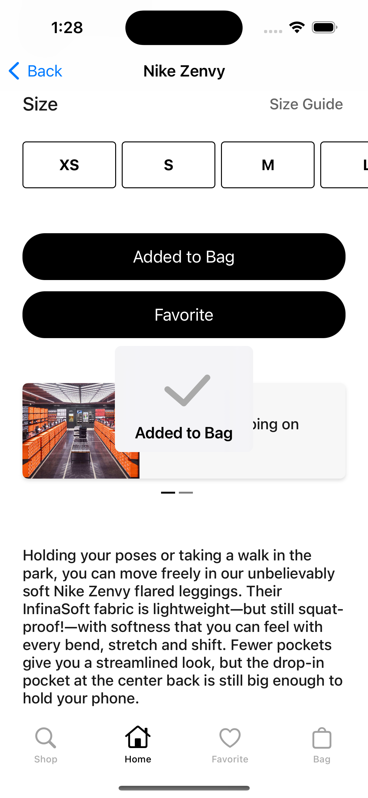
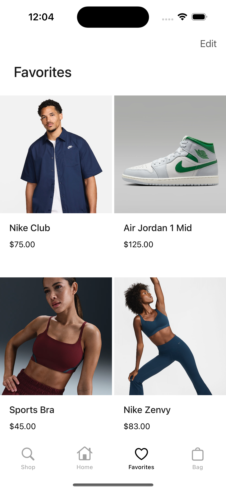
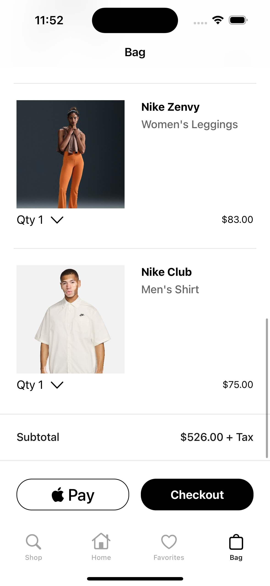

# Nike

## Описание

**Nike** — это мобильное приложение интернет-магазина бренда Nike. Проект создан с нуля как pet project для демонстрации современных подходов к архитектуре, чистому коду и UI/UX-дизайну.  
Приложение позволяет просматривать товары, выбирать разные категории, добавлять в избранное или корзину и оформлять заказы.

## Особенности проекта

- Использование **разных архитектур**: MVVM, MVP, MVC.
- Внедрение зависимостей через **Dependency Injection**.
- Чистый и структурированный код с соблюдением принципов **SOLID** и **Clean code**.
- Адаптивный интерфейс с продуманным пользовательским сценарием.
- Отображение данных из **JSON** и хранение состояния.
- Бизнес-логика покрыта тестами.

## Архитектура

| Экран         | Архитектура |
|---------------|-------------|
| Home          | MVVM        |
| Shop          | MVP         |
| Detail        | MVC         |
| Favorite      | MVC         |
| Bag           | MVC         |

## Внедрение зависимостей

В проекте используется собственный **DI-контейнер**, реализованный через `DependencyContainer` и `ScreenFactory`.

- Все зависимости (`URLSession`, `JSONDecoder`, `NetworkService`) создаются централизованно и передаются через инициализаторы.
- `ScreenFactory` использует эти зависимости для создания всех экранов.
- Такой подход позволяет:
  - Снизить связанность компонентов;
  - Упростить тестирование и масштабирование;
  - Соблюдать принципы SRP и DIP.

Контейнер внедряется один раз в начале жизненного цикла приложения и используется для построения всего интерфейса.

## Services

Проект использует несколько сервисов для управления данными и сетевыми запросами:

NetworkService
-   Загружает данные с локального сервера (localhost:3001).
-   Возвращает Result с декодированными моделями HomeSectionsResponse и ShopSectionsResponse.
-   Отделяет сетевую логику от UI через NetworkServiceProtocol.

FavoritesService & BagService
-   Сохраняют, загружают и удаляют данные с помощью UserDefaults.
-   Используют JSONEncoder/Decoder для работы с SubCategoryModel.
-   Поддерживают подсчёт общей суммы товаров и количества.
-   Реализуют через протоколы FavoritesServiceProtocol и BagServiceProtocol.
    
Такой подход делает код более тестируемым, расширяемым и удобным для поддержки.   

## Custom Views

Проект включает набор переиспользуемых кастомных вьюшек для унификации интерфейса и ускорения разработки:
-   CustomButton – настраиваемая кнопка с возможностью установки иконки, цветов, шрифта и обработчика нажатия.
-   ButtonContainerView – контейнер с кнопкой и разделителем для использования в списках или ячейках.
-   GradientView – вью с вертикальным градиентом, полезна для наложений поверх контента.
-   ShadowView – вью с тенями, включающимися по флагу isShadowEnabled.

## Tab Bar

Навигация в приложении реализована через кастомный TabBarController.
-   Содержит четыре экрана: Shop, Home, Favorites, Bag.
-   Каждый экран внедряется через DependencyContainer и оборачивается в UINavigationController.
-   При повторном нажатии на активный таб, экран автоматически прокручивается наверх (если он реализует протокол Scrollable).
-   По умолчанию выбран центральный экран — Home.
    
Такой подход обеспечивает удобную навигацию и позволяет повторно использовать логику прокрутки для разных экранов.

## Компоненты интерфейса & Design System

В проекте используются кастомные компоненты для переиспользуемости и упрощения настройки UI:

**ImageView**

Кастомный UIImageView с разными преднастроенными стилями, определяемыми через ImageViewType. Используется для унификации размеров, закруглений и прочих параметров. Примеры: .common, .favorite, .nearbySection, .product, .completeTheLook, и др.

**Label**

Кастомный UILabel (наследуется от InsetLabel) с предустановленными шрифтами, цветами и отступами. Примеры: .screenTitle, .price, .alwaysPopularBoltWeight, .highlighted, и др.

**StackView**

Кастомный UIStackView с различными конфигурациями осей, выравнивания и отступов. Примеры: .productCell, .headerStackView, .listHeader, и др.

## Extensions

В проекте активно используются расширения (extensions) для повышения читаемости кода, повторного использования логики и удобства при работе с UI-компонентами. Ниже приведены ключевые расширения:
-    **Date+WelcomeText.swift**

Генерация приветственного текста в зависимости от времени суток: "Good Morning, Alexander" и т.п.
-    **UICollectionViewCell + Extension.swift**

Добавлен протокол ReusableCollectionViewCell с computed-свойством reuseCVId для удобной регистрации и переиспользования ячеек коллекции.
-    **UICollectionView + Extension.swift**

Упрощена регистрация и извлечение ячеек.
-    **UITableViewCell + reuseId.swift**

Протокол Reusable и свойство reuseId для UITableViewCell.
-    **UITableViewCell + dequeueCell.swift**

Расширение для регистрации и извлечения ячеек таблицы по типу.
-    **UIColor + Extension.swift**

Метод adjustBrightness(by:) — изменение яркости цвета на заданный процент.
-    **ScrollToTop + Extension.swift**

Метод scrollToTop(animated:) для быстрого прокручивания таблицы вверх.
-   **Array + Extension.swift**

Безопасный доступ к элементам массива с помощью array[safe: index].
-    **UIResponder.swift**

Метод findParentViewController() для поиска родительского UIViewController.
-    **UINavigationController.swift**

Конфигурация navigation bar (шрифт, отступы, цвет) и добавление кнопки лупы (поиск).
-    **UIView + Extension.swift**
-    **Метод makeSeparator()** — создание стандартной линии-разделителя.
-    **Свойство viewController** — возвращает UIViewController, которому принадлежит UIView.

## Constants 

Для унификации и централизации всех повторяющихся значений в проекте используется структура констант. Это упрощает настройку дизайна, работу с текстами, шрифтами и изображениями, а также уменьшает количество “магических чисел” в коде.

- **Layout.swift**

Содержит отступы, используемые во всём проекте.

- **Constants.swift**

Содержит другие логические числовые значения, например количество баннеров и категорий.

- **Font.swift**

Централизованная работа с шрифтами (SF Pro Rounded).

- **Text.swift**

Хранит все строки UI (в том числе локализуемые), сгруппированные по экранам.

- **Images.swift**

Содержит имена системных и кастомных иконок.

## Unit Tests

Проект Nike покрыт модульными тестами с использованием XCTest. Основное внимание уделяется бизнес-логике, особенно экранам с динамическими данными и пользовательским взаимодействием.

Покрытые компоненты:
-   ShopViewController — проверка вызова viewDidLoad и обновления представления.
-   ShopPresenter — проверка корректной обработки событий (нажатия кнопок, загрузка данных).
-   ProductService — проверка обращения к сервису загрузки данных.

Используемые подходы:
-   Spy-объекты (ShopPresenterSpy, ShopControllerSpy, ProductServiceSpy) — для отслеживания вызовов методов.
-   Асинхронное ожидание (XCTestExpectation) — для проверки завершения загрузки данных и обновления UI.
-   Принцип Mocking Dependencies — используется внедрение зависимостей через протоколы.

## Экраны

### Home

- Приветствие пользователя в зависимости от времени суток.
- Горизонтальная промо-карусель.
- Секции с категориями товаров.
- Ознакомительные секции с товарами и их описанием.

**Архитектура:** MVVM  
**Интересные моменты:** динамическое приветствие, вложенные collectionView внутри tableView, reusability секций.

### Home screenshots

  
  
  

---

### Shop

- Список категорий: Men, Women, Kids.
- Каждая категория содержит:
- товары с изображениями и описанием;
- ознакомительные баннеры или статьи о продукте.

**Архитектура:** MVP  
**Интересные моменты:** презентер управляет логикой отображения и бизнес-логикой, экран масштабируется под любую категорию.

### Shop screenshots

  
  
  

---

### Detail

- Просмотр карточки товара с большим количеством фото.
- Добавление в корзину или избранное.
- Переключение между альтернативами товара.

**Архитектура:** MVC  
**Интересные моменты:** карусель изображений, кастомная кнопка добавления, состояние товара (выбран / нет).

### Detail screenshots

  
  

---

### Favorite

- Список всех избранных товаров.
- Удаление из избранного.
- Состояние автоматически сохраняется.

**Архитектура:** MVC  
**Интересные моменты:** синхронизация с корзиной и Detail, динамическое обновление UI.

### Favorite screenshots

  

---

### Bag

- Добавленные товары с возможностью удалить по свайпу и нажатию.
- Подсчет итоговой суммы.
- Возможность добавить товары в избранное прямо из корзины.

**Архитектура:** MVC  
**Интересные моменты:** пересчет стоимости в реальном времени, обработка пустой корзины, избранное из корзины.

### Bag screenshots

  

---

## Планы по развитию

- Авторизация и личный профиль
- Оформление и отправка заказа
- Темная тема

---

## Контакты

- Разработчик: Alexander Mileychik
- GitHub: github.com/AMileychik/Nike
- Email: amileychik@gmail.com

---

## Установка

1. Склонировать репозиторий можно с помощью терминала или Sourcetree по этой ссылке https://github.com/AMileychik/Nike.git

2. Открой .xcodeproj в Xcode.

3. Установи зависимости c помощью SPM.

4. Установи Mockoon (https://mockoon.com/download/).

5. Скопируй из проекта (папка Resources) файлы Home.json и Shop.json, создай  http://localhost:3001/shop и http://localhost:3001/home.

6. Запусти сервер на Mockoon (Start server).

5. Скомпилируй проект на симуляторе.

